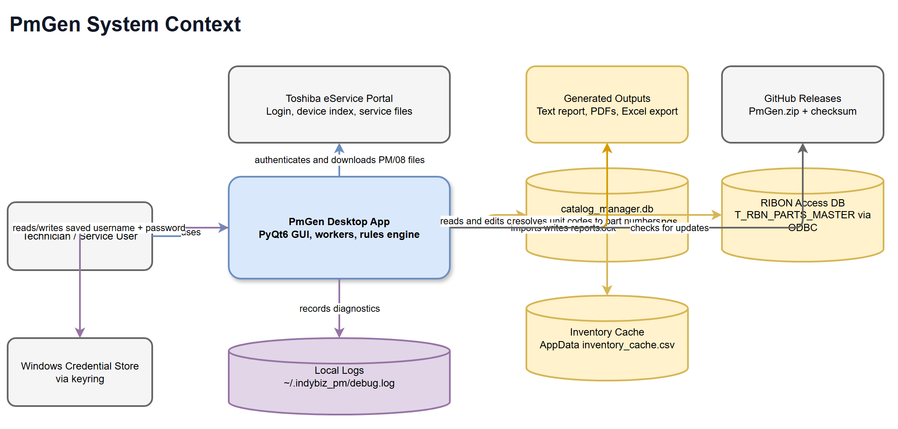
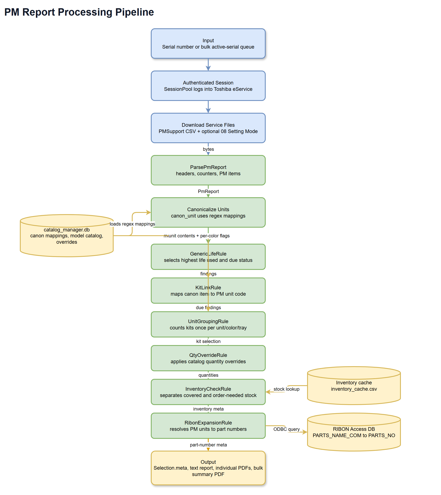
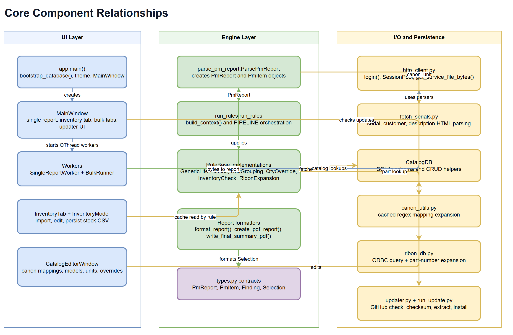
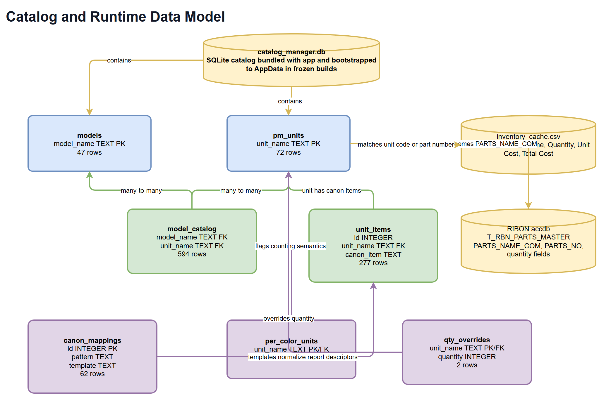
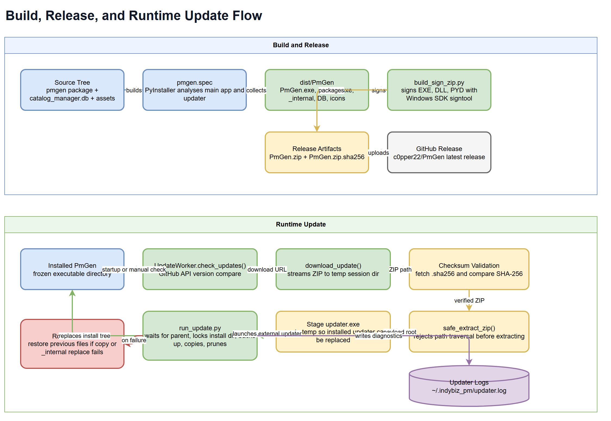

# PmGen Project Summary

## 1. Executive Summary

PmGen is a Windows desktop application for generating preventive maintenance part recommendations from Toshiba e-STUDIO service reports. The application signs into Toshiba eService, downloads PM Support and 08 Setting Mode data for single or bulk device serials, parses wear counters, applies a catalog-driven rules pipeline, and produces text, PDF, and spreadsheet outputs. It uses a bundled SQLite catalog for model-to-unit mappings, an inventory CSV cache for stock checks, and a RIBON Access database lookup to resolve PM unit codes into orderable part numbers. The project is packaged with PyInstaller and includes a self-updater that downloads signed release ZIPs from GitHub and validates SHA-256 checksums before installation.

## 2. Architecture Overview



PmGen is a local desktop system with three major external dependencies: Toshiba eService for device and report data, a RIBON Microsoft Access database for part-number resolution, and GitHub Releases for application updates. The GUI runs in PyQt6 and delegates network and report generation work to background workers so the interface remains responsive. Runtime state is stored locally through QSettings, the Windows credential store via `keyring`, the AppData inventory cache, rolling log files under `~/.indybiz_pm`, and the bootstrapped `catalog_manager.db` catalog.

The application boundary is intentionally thick: it owns report parsing, canon normalization, catalog editing, inventory management, report formatting, update orchestration, and PyInstaller packaging. External systems provide source data and release artifacts, but the core maintenance logic lives inside the `pmgen` package.

## 3. Processing Pipeline



The processing pipeline starts from either a manually entered serial in the Single tab or the active serial list fetched during a Bulk run. `SessionPool` creates logged-in `requests.Session` objects, then workers call `get_service_file_bytes()` to download PM Support data and optional 08 Setting Mode data. The PM Support bytes are parsed by `ParsePmReport()` into headers, counters, and PM items.

`canon_unit()` normalizes each raw PM unit descriptor through regex patterns stored in `catalog_manager.db`. `run_rules()` builds a `Context`, then applies the rule pipeline in this order:

| Stage | Component | Responsibility |
|---|---|---|
| 1 | `GenericLifeRule` | Selects the highest life-used value per canonical item and decides whether it is due. |
| 2 | `KitLinkRule` | Maps due canonical items to PM unit codes for the detected model. |
| 3 | `UnitGroupingRule` | Converts due findings into kit quantities while respecting per-color, drum, and cassette semantics. |
| 4 | `QtyOverrideRule` | Applies catalog-defined quantity overrides. |
| 5 | `InventoryCheckRule` | Compares selected kits against the local inventory cache and records covered or missing stock. |
| 6 | `RibonExpansionRule` | Resolves selected PM unit codes into part numbers and records grouped and flat part-number metadata. |

The final `Selection` object feeds report formatters. Single runs produce formatted text in the UI and can produce individual PDFs. Bulk runs process serials in a thread pool, rank successful devices by highest wear, generate individual PDFs, and write a consolidated `Final_Summary.pdf`.

## 4. Core Components



| Area | Files | Key components | Notes |
|---|---|---|---|
| GUI entry point | `pmgen/ui/app.py` | `main()`, `bootstrap_database()` | Sets application identity, installs diagnostics, applies theme, bootstraps the catalog, and opens `MainWindow`. |
| Main UI | `pmgen/ui/main_window.py` | `MainWindow`, `BulkRunTab`, `BulkSortFilterProxyModel` | Coordinates auth, single report generation, bulk jobs, inventory tab, catalog editor, and updater UI. |
| Background work | `pmgen/ui/workers.py` | `SingleReportWorker`, `BulkRunner`, `BulkConfig` | Runs network and report generation work outside the UI thread. |
| Report parsing | `pmgen/parsing/parse_pm_report.py` | `ParsePmReport`, `PmReport`, `PmItem` | Parses CSV-like PM Support report bytes into structured report data. |
| Rules engine | `pmgen/engine/run_rules.py`, `pmgen/rules/*.py` | `Context`, `RuleBase`, `PIPELINE` | Applies deterministic rules to turn wear data into selected PM units and part numbers. |
| Reporting | `pmgen/engine/single_report.py`, `pmgen/engine/final_report.py` | `format_report()`, `create_pdf_report()`, `write_final_summary_pdf()` | Generates UI text, individual PDFs, and bulk summary PDFs with ReportLab. |
| Catalog access | `pmgen/io/db_access.py` | `CatalogDB` | Owns SQLite schema creation and CRUD operations for models, units, mappings, overrides, and per-color flags. |
| Canon normalization | `pmgen/canon/canon_utils.py`, `pmgen/canon/regex_tokens.py` | `canon_unit()`, `expand_regex_tokens()` | Expands regex helper tokens and maps raw descriptors to canonical item names. |
| HTTP integration | `pmgen/io/http_client.py`, `pmgen/io/fetch_serials.py` | `login()`, `SessionPool`, parser helpers | Authenticates with Toshiba eService, fetches service files, and extracts device lists and metadata. |
| RIBON lookup | `pmgen/io/ribon_db.py`, `pmgen/engine/resolve_to_pn.py` | `query_parts_rows()`, `resolve_with_rows()` | Uses ODBC to resolve PM unit codes to RIBON part-number rows. |
| Inventory | `pmgen/ui/inventory.py` | `InventoryTab`, `InventoryModel`, `load_inventory_cache()` | Imports messy CSV exports, normalizes stock data, persists the cache, and supports rule-time stock checks. |
| Updates | `pmgen/updater/updater.py`, `pmgen/updater/run_update.py` | `UpdateWorker`, `install_update()` | Checks GitHub releases, verifies checksums, extracts safely, stages the updater, and performs rollback-capable install replacement. |

The main object contracts live in `pmgen/types.py`, while `parse_pm_report.py` also provides parser-compatible classes with matching property names. Rule implementations use duck typing around those properties, which keeps parsing and rule execution loosely coupled.

## 5. API Contracts / Message Schemas

PmGen does not expose a web API. Its contracts are internal Python objects, local files, external HTTP payloads, and database rows.

### PM Support Input

| Field | Source | Meaning |
|---|---|---|
| Header lines | PM Support CSV bytes | Title, report date, model, serial number, optional finisher serial. |
| `TOTAL` row | PM Support CSV bytes | Color, black, DF, and computed total counters. |
| `UNIT` rows | PM Support CSV bytes | Raw PM item descriptor plus current and expected page/drive counts. |

### Parsed Report Objects

| Object | Property | Type | Meaning |
|---|---|---|---|
| `PmReport` | `headers` | `dict[str, str]` | Parsed title, date, model, serial, and finisher values. |
| `PmReport` | `counters` | `dict[str, int | None]` | Color, black, DF, and total counters. |
| `PmReport` | `items` | `list[PmItem]` | Parsed PM unit rows. |
| `PmItem` | `descriptor` | `str` | Raw PM unit text from the report. |
| `PmItem` | `canon` | `str | None` | Canonical item name from `canon_unit()`. |
| `PmItem` | `page_current`, `page_expected` | `int | None` | Page counter life data. |
| `PmItem` | `drive_current`, `drive_expected` | `int | None` | Drive counter life data. |
| `PmItem` | `page_life`, `drive_life` | `float | None` | Current divided by expected count. |

### Rule Engine Objects

| Object | Property | Type | Meaning |
|---|---|---|---|
| `Context` | `report` | `PmReport` | Source report under evaluation. |
| `Context` | `model` | `str` | Parsed model string used for catalog matching. |
| `Context` | `items_by_canon` | `dict[str, list[PmItem]]` | Canonical item grouping for rule processing. |
| `Context` | `threshold`, `threshold_enabled` | `float`, `bool` | Early-due threshold configuration. |
| `Context` | `findings` | `dict[str, Finding]` | Per-canon rule results. |
| `Context` | `kit_selection` | `dict[str, int]` | Selected PM unit quantities before part-number expansion. |
| `Finding` | `canon` | `str` | Canonical item name. |
| `Finding` | `life_used` | `float | None` | Highest life fraction found for the item. |
| `Finding` | `due` | `bool` | Whether the item is due. |
| `Finding` | `kit_code` | `str | None` | PM unit code linked through the catalog. |
| `Selection` | `items` | `list[Finding]` | Due findings returned to report formatting. |
| `Selection` | `kits` | `dict[str, int]` | PM unit quantity selection. |
| `Selection` | `meta` | `dict[str, object]` | Watch items, all items, alerts, inventory results, due sources, and part-number maps. |

Important `Selection.meta` keys used by UI and report layers are `watch`, `all_items`, `alerts`, `inventory_matches`, `inventory_missing`, `due_sources`, `selection_pn`, `selection_pn_grouped`, and `kit_by_pn`.

### Local Data Stores



| Store | Location | Contract |
|---|---|---|
| `catalog_manager.db` | Working directory in source runs; AppData in frozen runs | SQLite catalog with `models`, `pm_units`, `model_catalog`, `unit_items`, `canon_mappings`, `qty_overrides`, and `per_color_units`. |
| `inventory_cache.csv` | AppData | CSV with `Part Number`, `Unit Name`, `Quantity`, `Unit Cost`, and `Total Cost`. |
| RIBON Access database | Configured through environment/runtime settings | ODBC source queried by `PARTS_NAME_COM`; returns rows containing a part-number field such as `PARTS_NO`. Requires the 64-bit Microsoft Access Database Engine driver; uninstall the x86 driver that may be installed by RIBON before installing the x64 redistributable. |
| `debug.log` and `updater.log` | `~/.indybiz_pm` | Rolling diagnostic logs for application and updater failures. |

The bundled SQLite database currently contains 47 models, 72 PM units, 594 model-unit links, 277 unit-item rows, 62 canon mappings, 5 per-color units, and 2 quantity overrides.

## 6. Infrastructure & Deployment



The production artifact is a Windows PyInstaller distribution built from `pmgen.spec`. The spec creates the main `PmGen` application from `pmgen/ui/app.py`, creates a one-file updater from `pmgen/updater/run_update.py`, includes the catalog database and icon assets, and excludes unused Qt modules to reduce package size.

`build_sign_zip.py` drives the release pipeline. It runs PyInstaller, discovers `signtool.exe` from the Windows SDK, signs generated executables, DLLs, and PYD files, zips `dist/PmGen` into `PmGen.zip`, and writes a SHA-256 sidecar file. The updater expects the GitHub release to publish both the ZIP and matching checksum file.

At runtime, `UpdateWorker` checks `c0pper22/PmGen` GitHub releases, compares the latest tag with `CURRENT_VERSION`, downloads the ZIP, fetches the checksum sidecar, validates SHA-256, and extracts into a temporary session directory. `perform_restart()` stages an updater executable into temp and launches it with the extracted payload, current install directory, target executable name, parent PID, and session ID. `run_update.py` waits for the parent process, acquires an install lock, validates the payload root, preserves local database files, replaces `_internal`, copies top-level files, prunes stale runtime files, and rolls back on failure.

## 7. Extension Patterns

### Add or Change Canon Normalization

1. Open the Catalog Editor and update the Canon Mappings tab, or use `CatalogDB.add_mapping()` and related methods.
2. Use built-in regex tokens from `pmgen/canon/regex_tokens.py` such as `{SPC}`, `{COLOR}`, and `{DF_TYPE}` to keep patterns readable.
3. Save changes so `reload_mappings_cache()` refreshes cached mappings.
4. Add or update a fixture under `tests/example_pm_reports/` when the mapping affects report results.

### Add a New Model or PM Unit

1. Add the model in the Catalog Editor Models tab or through `CatalogDB.add_model()`.
2. Add PM units in the PM Units tab or through `CatalogDB.add_unit()`.
3. Link units to models in `model_catalog` and define canon contents in `unit_items`.
4. Mark units in `per_color_units` only when one selected PM unit should count once per color channel.
5. Add `qty_overrides` only when the vendor kit quantity must override the grouped count.

### Add a New Rule

1. Create a class in `pmgen/rules/` that subclasses `RuleBase` and implements `apply(ctx: Context) -> None`.
2. Keep the rule side effects explicit by writing to `ctx.findings`, `ctx.kit_selection`, `ctx.alerts`, or `ctx.meta`.
3. Insert the rule into `PIPELINE` in `pmgen/engine/run_rules.py` at the point where its inputs already exist.
4. Add regression tests around both the direct rule result and the report-level metadata expected by UI and PDF code.

### Add New Bulk Metadata from 08 Setting Mode

1. Extend `BulkConfig` with the setting name and code or reuse `custom_08_name` and `custom_08_code`.
2. Use `_parse_code_from_08_bytes()` in `pmgen/io/http_client.py` or add a focused parser helper next to the existing 08 helpers.
3. Add the value to `BulkQueueModel` only after confirming column indices stay stable for sorting and export.
4. Cover filtering and display behavior in `tests/ui/test_workers.py` or `tests/ui/test_bulk_model.py`.

## 8. Rules & Anti-Patterns

| Do | Avoid |
|---|---|
| Keep catalog-driven behavior in SQLite tables when the change is data, not code. | Hard-coding model-specific kit mappings inside rule classes. |
| Keep rule outputs in `Selection.meta` stable because UI and PDF formatters depend on those keys. | Renaming or removing metadata keys without updating formatters and tests. |
| Use `CatalogDB` for catalog reads and writes so schema creation and foreign keys stay centralized. | Opening ad hoc SQLite connections from UI code for catalog edits. |
| Use `SessionPool` for bulk HTTP work and keep network calls off the UI thread. | Blocking the PyQt event loop with downloads, parsing, PDF generation, or ODBC calls. |
| Keep updater extraction and install paths guarded by validation, locks, checksum checks, and rollback. | Extracting release archives directly into the install directory. |
| Keep credentials in the OS credential store or secured runtime configuration. | Writing secrets, tokens, passwords, or raw connection credentials into generated docs, logs, or release notes. |
| Add tests around parser, rule, updater, and UI model contracts when behavior changes. | Treating PDF generation as the only validation of rule behavior. |

## 9. Dependencies

| Category | Package | Version | Usage |
|---|---|---|---|
| GUI | `PyQt6`, `PyQt6-Qt6`, `PyQt6_sip` | 6.10.0, 6.10.0, 13.10.2 | Desktop UI, dialogs, table models, QSettings, threading, AppData paths. |
| HTTP | `requests`, `urllib3`, `certifi`, `charset-normalizer`, `idna` | 2.32.5, 2.5.0, 2025.10.5, 3.4.4, 3.11 | Toshiba eService login, downloads, GitHub update checks. |
| HTML parsing | `beautifulsoup4`, `bs4`, `soupsieve` | 4.14.2, 0.0.2, 2.8 | Device index serial, customer, and description parsing. |
| Credentials | `keyring`, `jaraco.classes`, `jaraco.context`, `jaraco.functools`, `more-itertools`, `pywin32-ctypes` | 25.6.0, 3.4.0, 6.0.1, 4.3.0, 10.8.0, 0.2.3 | OS-backed credential storage. |
| Database | `pyodbc` | 5.3.0 | Microsoft Access RIBON lookup through ODBC. Requires the x64 Microsoft Access Database Engine driver from <https://www.microsoft.com/en-us/download/details.aspx?id=54920>. |
| Reports | `reportlab` | 4.4.4 | Individual and bulk summary PDF generation. |
| Data processing | `numpy`, `pandas` | 2.3.5, 2.3.3 | Inventory CSV cleanup, table export, stock calculations. |
| Packaging | `pyinstaller`, `pyinstaller-hooks-contrib` | 6.16.0, 2025.9 | Windows frozen app and updater packaging. |
| Typing | `typing_extensions` | 4.15.0 | Compatibility typing helpers. |

The UI export path writes Excel files through pandas with the `openpyxl` engine, and `pmgen.spec` includes `openpyxl` as a hidden import. Keep the packaged environment aligned with that behavior.

## 10. Code Structure

```text
PmGen/
|-- build_sign_zip.py          # PyInstaller build, recursive signing, ZIP and checksum creation
|-- create_database.py         # Catalog seed data and canon mapping source
|-- catalog_manager.db         # Bundled SQLite catalog used by rules and catalog editor
|-- pmgen.spec                 # PyInstaller build specification for app and updater
|-- requirements.txt           # Runtime/build dependency pins
|-- pmgen/
|   |-- canon/                 # Canonical unit normalization and regex token expansion
|   |-- catalog/               # Lightweight catalog model helpers
|   |-- engine/                # Rule orchestration, report formatting, part-number resolution
|   |-- io/                    # HTTP, SQLite, RIBON Access, and serial parsing integrations
|   |-- parsing/               # PM Support report parser
|   |-- rules/                 # RuleBase and concrete maintenance-selection rules
|   |-- system/                # Logging, crash handlers, safe PyQt slot wrapper
|   |-- ui/                    # PyQt6 application, windows, widgets, workers, inventory, theme
|   |-- updater/               # GitHub updater worker and external installer process
|   |-- types.py               # Dataclass contracts shared by engine and rules
|-- tests/
|   |-- example_pm_reports/    # CSV and JSON fixtures for full report expectations
|   |-- full_report_testing/   # Parser/rules/report regression tests
|   |-- ui/                    # UI model and worker tests
|   |-- updater/               # Updater safety and rollback tests
|-- docs/
|   |-- project-summary.md     # This source document
|   |-- diagrams/              # Editable draw.io diagrams and exported PNGs
```

The active source package is `pmgen/`. The `_internal/` directory in the workspace mirrors packaged runtime content and should be treated as generated or distribution support unless a build process explicitly requires changes there.
